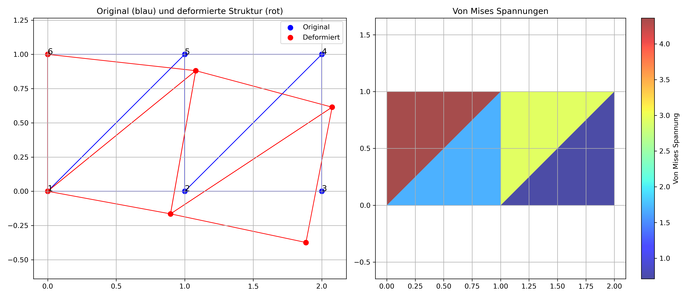

# FEM Dreieckselement-Analyse

Dieses Python-Skript implementiert eine 2D Finite-Element-Methode (FEM) Analyse mit linearen Dreieckselementen für strukturmechanische Probleme.

## Funktionalität

Das Programm berechnet:
- Verschiebungen an Knoten
- Dehnungen und Spannungen in Elementen
- Von-Mises-Spannungen
- Reaktionskräfte an fixierten Knoten

## Beispielmodell

Das implementierte Beispiel zeigt ein einfaches Rechteck, bestehend aus:
- 6 Knoten
- 4 Dreieckselementen
- Fixierte Knoten (1 und 6)
- Eine Last in negativer y-Richtung auf Knoten 4

## Anforderungen

- Python 3.x
- NumPy
- Matplotlib

## Install & Run
### 1. Klonen des Repositorys
```console
cd dir-where-you-want-the-repo
git clone https://github.com/Zascosium/FEM-python.git
cd FEM-python
```
### 2. Installiere notwendige Biblitheken
```console
pip install -r requirements.txt
```
### 3. Skript ausführen
```console
python main.py
```

## Ausgabe

Das Skript generiert:
1. Konsolenausgabe mit:
   - Verschiebungen für jeden Knoten
   - Spannungskomponenten für jedes Element
   - Von-Mises-Spannungen für jedes Element
   - Reaktionskräfte an fixierten Knoten

2. Visualisierung:
   - Originale und deformierte Struktur (links)
   - Verteilung der Von-Mises-Spannungen (rechts)
   - Grafik wird als 'fem_result.png' gespeichert
     

## Anpassung

Um andere Strukturen zu analysieren, modifizieren Sie:
- Die Knoten-Koordinaten (`nodes`)
- Die Element-Definitionen (`elements`)
- Die Materialmatrix (`D`)
- Die Randbedingungen (fixierte Freiheitsgrade und angewandte Kräfte)
